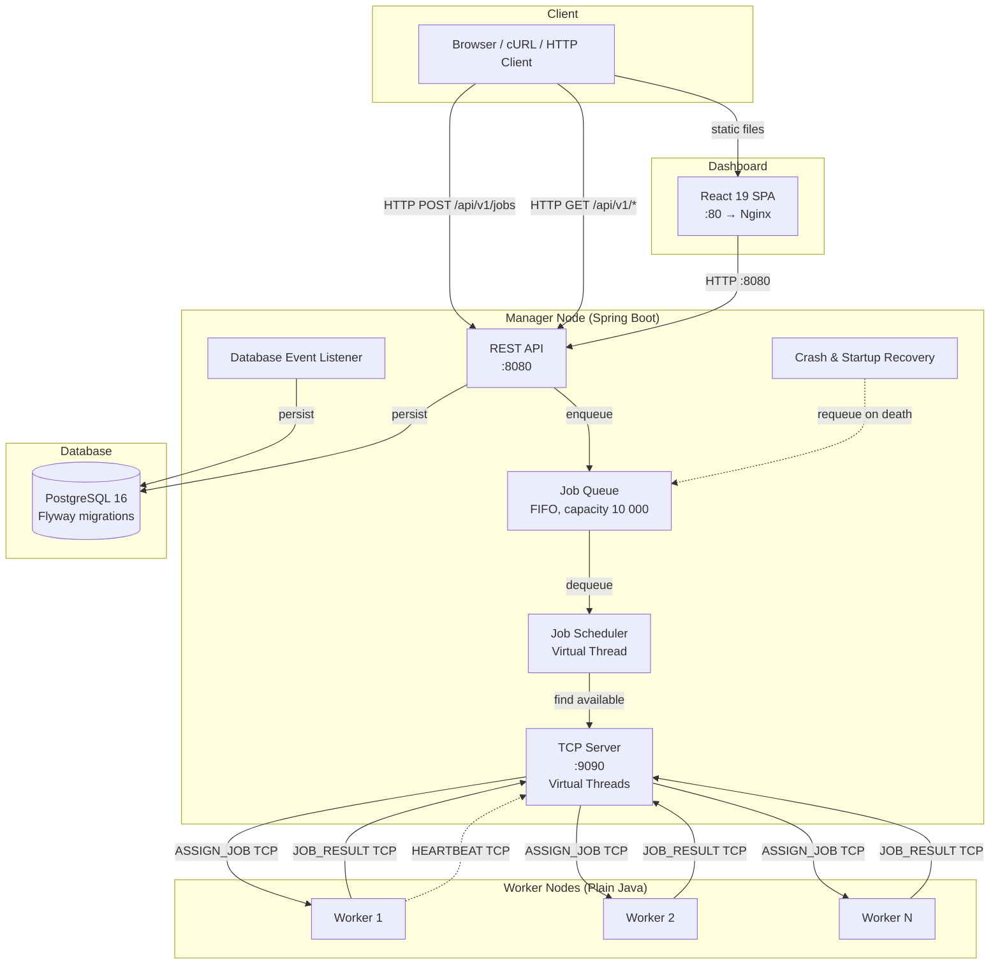

# Fern-OS — Distributed Job Orchestration Platform


A distributed job orchestration platform that schedules workloads across TCP-connected worker nodes with crash recovery, real-time monitoring, and a React dashboard. Built with Java 21 virtual threads, Spring Boot 3.3, PostgreSQL, and React 19.

---

## Table of Contents

- [Architecture Overview](#architecture-overview)
- [Quickstart](#quickstart)
- [API Reference](#api-reference)
- [Configuration](#configuration)
- [Testing](#testing)
- [Project Structure](#project-structure)
- [Contributing](#contributing)
- [License](#license)

---

## Architecture Overview



### Component Summary

| Component | Technology | Role |
|-----------|------------|------|
| **engine-core** | Java 21 (no Spring) | Shared library: domain models (`Job`, `WorkerConnection`), protocol codec (binary wire format), thread-safe registries, event interfaces |
| **manager-node** | Spring Boot 3.3, Java 21 | Central orchestrator: REST API, TCP server, job scheduler, crash recovery, PostgreSQL persistence via JPA + Flyway |
| **worker-node** | Plain Java 21 (no Spring) | Lightweight TCP client: connects to manager, executes tasks via plugins (Echo, Sleep, Fibonacci, ShellScript), reports results |
| **dashboard** | React 19, TypeScript, Vite, TailwindCSS | Real-time web UI: job submission, job queue view, worker monitoring |
| **PostgreSQL 16** | Docker container | Persistent storage for jobs and workers with Flyway schema migrations |

### Communication Protocol

Manager ↔ Workers communicate over raw TCP sockets using a binary wire format:

```
[1 byte: MessageType][4 bytes: payload length (big-endian)][N bytes: JSON payload]
```

Supported message types: `REGISTER_WORKER`, `REGISTER_ACK`, `HEARTBEAT`, `ASSIGN_JOB`, `JOB_RUNNING`, `JOB_RESULT`, `CANCEL_JOB`.

---

## Quickstart

### Prerequisites

| Requirement | Version |
|-------------|---------|
| Java | 21+ |
| Maven | 3.8+ |
| Docker & Docker Compose | v26+ / v2.24+ |
| Node.js (for dashboard dev) | 20+ |

### Running with Docker Compose (Recommended)

Get a fully operational cluster in **3 commands**:

```bash
# 1. Clone and enter the project
git clone https://github.com/moadabdou/FernOS.git&& cd FernOS

# 2. Copy environment config
cp .env.example .env
# Optionally edit JWT_SECRET in .env

# 3. Launch everything
docker compose up -d --build
```

This starts:

| Service | Port | Description |
|---------|------|-------------|
| PostgreSQL | `5433` | Database (mapped to host) |
| Manager API | `8080` (HTTP), `9090` (TCP) | REST API + TCP server |
| Worker × 3 | — | Auto-scaling worker replicas |
| Dashboard | `80` | React web UI |

**Verify it's running:**

```bash
# Check manager health
curl http://localhost:8080/actuator/health

# Submit a test job
curl -X POST http://localhost:8080/api/v1/jobs \
  -H "Content-Type: application/json" \
  -d '{"payload": "{\"type\":\"echo\",\"data\":\"hello fern-os\"}"}'

# Open dashboard
open http://localhost:80
```

**Scale workers:**

```bash
docker compose up -d --scale worker=6
```

### Running Locally (Development)

```bash
# 1. Start only the database
docker compose up -d postgres

# 2. Build the Java modules
./mvnw clean install -DskipTests

# 3. Run the manager
cd manager-node && ../mvnw spring-boot:run

# 4. Run a worker (in another terminal)
cd worker-node && ../mvnw exec:java \
  -Dexec.mainClass="com.doe.worker.Main" \
  -Dexec.args="--dev"

# 5. Run the dashboard (in another terminal)
cd dashboard && npm install && npm run dev
```

---

## API Reference

Base URL: `http://localhost:8080/api/v1`

All request/response bodies are JSON.

### Job Status Enum

| Value | Description |
|-------|-------------|
| `PENDING` | Queued, waiting for an available worker |
| `ASSIGNED` | Dispatched to a worker, awaiting `JOB_RUNNING` |
| `RUNNING` | Worker has acknowledged and is executing |
| `COMPLETED` | Finished successfully |
| `FAILED` | Execution failed (after retries exhausted) |
| `CANCELLED` | Cancelled by user |

---

### `POST /api/v1/jobs` — Submit a Job

Create a new job and enqueue it into the scheduler queue.

**Request Body:**

```json
{
  "payload": "{\"type\":\"echo\",\"data\":\"hello world\"}"
}
```

The `payload` is a JSON-encoded string containing:

| Field | Type | Required | Description |
|-------|------|----------|-------------|
| `type` | string | Yes | Task type: `echo`, `sleep`, `fibonacci`, `shell` |
| `data` | string | Yes | Task-specific data (see examples below) |

**Task Payload Examples:**

```json
// Echo — returns data unchanged
{"type": "echo", "data": "hello"}

// Sleep — sleeps for N milliseconds
{"type": "sleep", "data": "{\"ms\": 5000}"}

// Fibonacci — computes Nth Fibonacci number (max n=40)
{"type": "fibonacci", "data": "{\"n\": 20}"}

// Shell — executes a bash command
{"type": "shell", "data": "{\"script\": \"echo hello && date\"}"}
```

**Response — `201 Created`:**

```json
{
  "id": "a1b2c3d4-e5f6-7890-abcd-ef1234567890",
  "status": "PENDING",
  "payload": "{\"type\":\"echo\",\"data\":\"hello world\"}",
  "result": null,
  "workerId": null,
  "retryCount": 0,
  "createdAt": "2025-04-10T12:00:00Z",
  "updatedAt": "2025-04-10T12:00:00Z"
}
```

**Error Responses:**

| Status | Condition |
|--------|-----------|
| `400` | Invalid request body |
| `429` | Job queue is full (capacity: 10 000) |

---

### `GET /api/v1/jobs` — List Jobs

**Query Parameters:**

| Parameter | Type | Default | Description |
|-----------|------|---------|-------------|
| `page` | int | `0` | Page number (zero-based) |
| `size` | int | `20` | Page size |
| `status` | string | — | Filter by status (e.g., `PENDING`, `COMPLETED`) |

**Request:**

```
GET /api/v1/jobs?page=0&size=10&status=PENDING
```

**Response — `200 OK`:**

Spring Data `Page<JobResponse>` (paginated JSON array with metadata).

---

### `GET /api/v1/jobs/{id}` — Get Job by ID

**Request:**

```
GET /api/v1/jobs/a1b2c3d4-e5f6-7890-abcd-ef1234567890
```

**Response — `200 OK`:**

```json
{
  "id": "a1b2c3d4-e5f6-7890-abcd-ef1234567890",
  "status": "COMPLETED",
  "payload": "{\"type\":\"echo\",\"data\":\"hello world\"}",
  "result": "hello world",
  "workerId": "b2c3d4e5-f6a7-8901-bcde-f12345678901",
  "retryCount": 0,
  "createdAt": "2025-04-10T12:00:00Z",
  "updatedAt": "2025-04-10T12:00:05Z"
}
```

**Error Responses:**

| Status | Condition |
|--------|-----------|
| `404` | Job not found |

---

### `POST /api/v1/jobs/{id}/cancel` — Cancel a Job

**Request:**

```
POST /api/v1/jobs/a1b2c3d4-e5f6-7890-abcd-ef1234567890/cancel
```

**Response — `200 OK`:** `JobResponse` with status `CANCELLED` (or `FAILED` if already completed).

**Error Responses:**

| Status | Condition |
|--------|-----------|
| `404` | Job not found |

---

### `GET /api/v1/workers` — List All Workers

**Request:**

```
GET /api/v1/workers
```

**Response — `200 OK`:**

```json
[
  {
    "id": "b2c3d4e5-f6a7-8901-bcde-f12345678901",
    "hostname": "worker-abc123",
    "ipAddress": "172.18.0.5",
    "status": "ONLINE",
    "maxCapacity": 4,
    "activeJobCount": 2,
    "lastHeartbeat": "2025-04-10T12:00:10Z"
  }
]
```

---

### `GET /api/v1/workers/{workerId}` — Get Worker by ID

**Request:**

```
GET /api/v1/workers/b2c3d4e5-f6a7-8901-bcde-f12345678901
```

**Response — `200 OK`:** `WorkerResponse` object.

**Error Responses:**

| Status | Condition |
|--------|-----------|
| `404` | Worker not found |

---

### Error Response Format

All error responses follow a consistent JSON structure:

```json
{
  "timestamp": "2025-04-10T12:00:00Z",
  "status": 400,
  "error": "Bad Request",
  "message": "Payload must be a valid JSON string"
}
```

---

### Actuator Endpoints

| Endpoint | Port | Description |
|----------|------|-------------|
| `/actuator/health` | 8080 | Health check (DB connectivity) |
| `/actuator/info` | 8080 | Application info |
| `/actuator/metrics` | 8080 | Micrometer metrics |
| `/actuator/prometheus` | 8080 | Prometheus-format metrics |

---

## Configuration

### Environment Variables

| Variable | Required | Default | Description |
|----------|----------|---------|-------------|
| `JWT_SECRET` | **Yes** | — | HMAC-SHA256 secret for worker authentication tokens |
| `WORKER_AUTH_TOKEN` | No | *(empty)* | Static token for workers. Leave empty to skip worker auth checks |
| `DB_PASSWORD` | No | `fernos_pass` | PostgreSQL password (used in Docker Compose) |
| `VITE_API_BASE_URL` | No | `http://localhost:8080` | Dashboard API base URL (build-time for React) |

### `application.yml` Reference (Manager Node)

| Property | Default | Description |
|----------|---------|-------------|
| `server.port` | `8080` | HTTP REST API port |
| `server.tcp.port` | `9090` | TCP server port for worker connections |
| `spring.datasource.url` | `jdbc:postgresql://localhost:5432/fernos` | JDBC connection string (`DB_HOST` env var supported) |
| `spring.datasource.username` | `root` | Database username |
| `spring.datasource.password` | `root` | Database password |
| `spring.jpa.hibernate.ddl-auto` | `validate` | Hibernate DDL mode (use `validate` — schema managed by Flyway) |
| `spring.jpa.show-sql` | `false` | Log SQL statements |
| `spring.flyway.enabled` | `true` | Enable Flyway schema migrations |
| `manager.security.jwt.secret` | *(hardcoded default)* | JWT signing secret — **override via env/CLI in production** |
| `manager.worker.default-max-capacity` | `4` | Default max concurrent jobs per worker |
| `job-queue.capacity` | `10000` | In-memory job queue maximum size |
| `fernos.heartbeat.check.interval` | `5000` ms | Heartbeat check frequency |
| `fernos.heartbeat.timeout` | `15000` ms | Time before a worker is declared dead |
| `management.endpoints.web.exposure.include` | `health,info,metrics,prometheus` | Actuator endpoints to expose |

### Logging Environment Variables

| Variable | Default | Description |
|----------|---------|-------------|
| `LOGGING_LEVEL_ROOT` | `INFO` | Root logger level |
| `LOGGING_LEVEL_COM_DOE` | `INFO` | `com.doe` package logger level |
| `LOGGING_LEVEL_SPRING_WEB` | `INFO` | Spring Web logger level |
| `LOGGING_LEVEL_HIBERNATE_SQL` | `WARN` | Hibernate SQL logger level |

### Worker CLI Arguments

| Argument | Env Var | Default | Description |
|----------|---------|---------|-------------|
| `--host` | `MANAGER_HOST` | `localhost` | Manager hostname |
| `--port` | `MANAGER_PORT` | `9090` | Manager TCP port |
| `--auth-token` | `WORKER_AUTH_TOKEN` | *(none)* | JWT authentication token |
| `--dev` | `WORKER_DEV_MODE` | `false` | Dev mode — auto-generates a JWT token from `MANAGER_SECURITY_JWT_SECRET` |

---

## Testing

### Unit Tests

Run all Java unit tests:

```bash
./mvnw test
```

| Module | Test Count | Coverage |
|--------|-----------|----------|
| `engine-core` | 4 | Job state machine (14 cases), protocol codec, worker registry concurrency, retry policy |
| `manager-node` | 14 | REST controllers, job queue, scheduler, crash recovery, startup recovery, DB event listener |
| `worker-node` | 8 | Worker client integration, all 4 task plugins (Echo, Sleep, Fibonacci, ShellScript) |

Run tests for a specific module:

```bash
./mvnw test -pl engine-core
./mvnw test -pl manager-node
./mvnw test -pl worker-node
```

### Integration Tests

Manager-node includes integration tests with **Testcontainers** (spins up a real PostgreSQL container):

```bash
./mvnw verify -pl manager-node -Dtest="*IntegrationTest"
```

The `TestManagerServerBuilder` utility allows in-memory TCP server testing without Docker:

```bash
./mvnw test -pl manager-node -Dtest="ManagerServerIntegrationTest"
```

### Dashboard Tests

Dashboard API client tests use **Vitest** with `axios-mock-adapter`:

```bash
cd dashboard
npm test
```

### End-to-End Tests

The `automated_tests/` directory contains Python scripts for end-to-end testing against a running cluster:

```bash
pip install requests
python automated_tests/test_sleep_jobs.py
```

This submits sleep jobs, monitors their lifecycle, and validates end-to-end job execution.

---

## Project Structure

```
distributed_orchestration_engine/
├── engine-core/                  # Shared library (no Spring)
│   ├── src/main/java/com/doe/core/
│   │   ├── model/                # Domain models: Job, JobStatus, WorkerConnection, WorkerStatus
│   │   ├── protocol/             # Binary protocol: Message, MessageType, Encoder, Decoder
│   │   ├── registry/             # Thread-safe registries: WorkerRegistry, JobRegistry
│   │   ├── event/                # EngineEventListener event interface
│   │   ├── executor/             # TaskExecutor strategy interface
│   │   └── util/                 # RetryPolicy utility
│   └── src/test/java/            # Unit tests
│
├── manager-node/                 # Spring Boot orchestrator
│   ├── src/main/java/com/doe/manager/
│   │   ├── ManagerApplication.java
│   │   ├── server/               # TCP server (virtual threads), heartbeat monitor
│   │   ├── api/                  # REST controllers, DTOs, services, exception handler
│   │   ├── scheduler/            # JobScheduler, JobQueue, JobTimeoutMonitor
│   │   ├── recovery/             # StartupRecoveryService, CrashRecoveryHandler
│   │   ├── persistence/          # JPA entities, DatabaseEventListener
│   │   ├── config/               # Spring bean configuration
│   │   └── metrics/              # Micrometer metrics configuration
│   ├── src/main/resources/
│   │   ├── application.yml       # Application configuration
│   │   ├── db/migration/         # Flyway SQL migrations
│   │   └── logback-spring.xml    # Logging configuration
│   ├── src/test/java/            # Unit + integration tests
│   └── Dockerfile
│
├── worker-node/                  # Plain Java TCP client
│   ├── src/main/java/com/doe/worker/
│   │   ├── Main.java             # Entry point, CLI parsing
│   │   ├── client/               # WorkerClient (TCP connection, message loop)
│   │   └── executor/             # Task plugins: Echo, Sleep, Fibonacci, ShellScript
│   ├── src/main/resources/
│   │   └── logback.xml           # Logging configuration
│   ├── src/test/java/            # Unit tests
│   └── Dockerfile
│
├── dashboard/                    # React 19 SPA
│   ├── src/
│   │   ├── api/                  # Axios API client, jobs/workers API modules
│   │   ├── components/           # React UI components
│   │   ├── hooks/                # Custom React hooks
│   │   └── pages/                # Page components
│   ├── Dockerfile                # Multi-stage: Node build → Nginx serve
│   ├── package.json
│   └── vite.config.ts
│
├── automated_tests/              # Python E2E test scripts
│   └── test_sleep_jobs.py
│
├── docker-compose.yml            # Full cluster orchestration
├── .env.example                  # Environment variable template
├── pom.xml                       # Maven parent POM (BOM)
└── README.md                     # This file
```

### Module Dependency Graph

```
engine-core  (shared library, zero Spring dependencies)
    ↑
    ├── manager-node  (Spring Boot, depends on engine-core)
    └── worker-node   (plain Java, depends on engine-core)

dashboard  (React SPA, independent — communicates via HTTP REST)
```

---

## Contributing

See [CONTRIBUTING.md](CONTRIBUTING.md) for detailed guidelines.

### Quick Summary

- **Branch naming:** `<type>/<short-description>` — e.g., `feat/shell-plugin`, `fix/heartbeat-timeout`
- **Types:** `feat`, `fix`, `docs`, `refactor`, `test`, `chore`
- **Commits:** [Conventional Commits](https://www.conventionalcommits.org/) format
- **Code style:** Google Java Format (4-space indent), run `./mvnw checkstyle:check` before PR
- **Tests:** All PRs must pass `./mvnw test` + `cd dashboard && npm test`
- **PR process:** Branch → PR → at least 1 approval → merge to `main`

---

## License

[Specify your license here]

---

*Built with ☕ Java 21 Virtual Threads and 🌱 Spring Boot 3.3*
