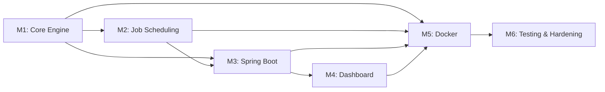

# 🗺️ Project Roadmap — Distributed Job Orchestration Platform

> **29 issues** across **6 milestones** · Estimated **25–32 working days** total

---

## Milestone Overview

| # | Milestone | Issues | Estimate | Dependencies |
|---|-----------|--------|----------|--------------|
| **1** | [Core Engine — TCP & Workers](milestone-1-core-engine/details.md) | #001–#005 (5) | 5–7 days | None |
| **2** | [Job Scheduling & Fault Tolerance](milestone-2-job-scheduling-fault-tolerance/details.md) | #006–#010 (5) | 4–5 days | M1 |
| **3** | [Spring Boot Management Plane](milestone-3-spring-boot-management-plane/details.md) | #011–#015 (5) | 5–6 days | M1, M2 |
| **4** | [Observability Dashboard (TypeScript)](milestone-4-observability-dashboard/details.md) | #016–#020 (5) | 4–5 days | M3 |
| **5** | [Dockerization & DevOps](milestone-5-dockerization-devops/details.md) | #021–#024 (4) | 3–4 days | M1–M4 |
| **6** | [Testing & Production Hardening](milestone-6-testing-hardening/details.md) | #025–#029 (5) | 4–5 days | M1–M5 |

---

## Dependency Graph

---

## Issue Index

### Milestone 1 — Core Engine
| Issue | Title | Priority | Estimate |
|-------|-------|----------|----------|
| [#001](milestone-1-core-engine/issue-001-project-scaffold.md) | Initialize Multi-Module Project Scaffold | 🔴 High | 0.5d |
| [#002](milestone-1-core-engine/issue-002-binary-protocol-codec.md) | Custom Binary Protocol Encoder/Decoder | 🔴 High | 1d |
| [#003](milestone-1-core-engine/issue-003-manager-server.md) | Manager Server with Virtual Threads | 🔴 High | 1.5d |
| [#004](milestone-1-core-engine/issue-004-worker-client.md) | Worker Client with Registration | 🔴 High | 1d |
| [#005](milestone-1-core-engine/issue-005-heartbeat-mechanism.md) | Heartbeat & Dead Worker Detection | 🔴 High | 1d |

### Milestone 2 — Job Scheduling & Fault Tolerance
| Issue | Title | Priority | Estimate |
|-------|-------|----------|----------|
| [#006](milestone-2-job-scheduling-fault-tolerance/issue-006-job-model-state-machine.md) | Job Model & State Machine | 🔴 High | 0.5d |
| [#007](milestone-2-job-scheduling-fault-tolerance/issue-007-job-queue-scheduler.md) | Job Queue & Scheduler | 🔴 High | 1d |
| [#008](milestone-2-job-scheduling-fault-tolerance/issue-008-worker-job-execution.md) | Worker Job Execution & Result Reporting | 🔴 High | 1d |
| [#009](milestone-2-job-scheduling-fault-tolerance/issue-009-result-handling.md) | Manager Result Handling & Job Completion | 🔴 High | 0.5d |
| [#010](milestone-2-job-scheduling-fault-tolerance/issue-010-crash-recovery.md) | Crash Recovery & Job Re-Queuing | 🔥 Critical | 1d |

### Milestone 3 — Spring Boot Management Plane
| Issue | Title | Priority | Estimate |
|-------|-------|----------|----------|
| [#011](milestone-3-spring-boot-management-plane/issue-011-spring-boot-refactor.md) | Refactor Manager to Spring Boot Service | 🔴 High | 1d |
| [#012](milestone-3-spring-boot-management-plane/issue-012-jpa-entities-repositories.md) | JPA Entities, Repositories & Schema | 🔴 High | 1d |
| [#013](milestone-3-spring-boot-management-plane/issue-013-rest-api-controllers.md) | REST API Controllers (Jobs & Workers) | 🔴 High | 1d |
| [#014](milestone-3-spring-boot-management-plane/issue-014-engine-db-sync.md) | Engine ↔ Database Event Sync | 🔴 High | 1d |
| [#015](milestone-3-spring-boot-management-plane/issue-015-startup-recovery.md) | Manager Startup Recovery from DB | 🔥 Critical | 0.5d |

### Milestone 4 — Observability Dashboard
| Issue | Title | Priority | Estimate |
|-------|-------|----------|----------|
| [#016](milestone-4-observability-dashboard/issue-016-scaffold-frontend.md) | Scaffold React + TypeScript Project | 🔴 High | 0.5d |
| [#017](milestone-4-observability-dashboard/issue-017-api-client-service.md) | Typed API Client Service | 🔴 High | 0.5d |
| [#018](milestone-4-observability-dashboard/issue-018-workers-view.md) | Workers View: Live Worker Grid | 🔴 High | 1d |
| [#019](milestone-4-observability-dashboard/issue-019-jobs-view.md) | Jobs View: Filterable Job List | 🔴 High | 1d |
| [#020](milestone-4-observability-dashboard/issue-020-dashboard-overview.md) | Dashboard Overview & Navigation Shell | 🟡 Medium | 1d |

### Milestone 5 — Dockerization & DevOps
| Issue | Title | Priority | Estimate |
|-------|-------|----------|----------|
| [#021](milestone-5-dockerization-devops/issue-021-manager-dockerfile.md) | Dockerfile for Spring Boot Manager | 🔴 High | 0.5d |
| [#022](milestone-5-dockerization-devops/issue-022-worker-dockerfile.md) | Dockerfile for Java Worker | 🔴 High | 0.5d |
| [#023](milestone-5-dockerization-devops/issue-023-dashboard-dockerfile.md) | Dockerfile for Dashboard (Nginx) | 🔴 High | 0.5d |
| [#024](milestone-5-dockerization-devops/issue-024-docker-compose.md) | Docker Compose Orchestration | 🔥 Critical | 1d |

### Milestone 6 — Testing & Hardening
| Issue | Title | Priority | Estimate |
|-------|-------|----------|----------|
| [#025](milestone-6-testing-hardening/issue-025-structured-logging.md) | Structured Logging with MDC | 🔴 High | 0.5d |
| [#026](milestone-6-testing-hardening/issue-026-integration-tests.md) | Integration Test Suite | 🔴 High | 1.5d |
| [#027](milestone-6-testing-hardening/issue-027-chaos-testing.md) | Chaos Testing Harness | 🔥 Critical | 1d |
| [#028](milestone-6-testing-hardening/issue-028-metrics-endpoint.md) | Metrics Endpoint (Actuator) | 🟡 Medium | 0.5d |
| [#029](milestone-6-testing-hardening/issue-029-documentation.md) | Project Documentation & Architecture | 🟡 Medium | 1d |
